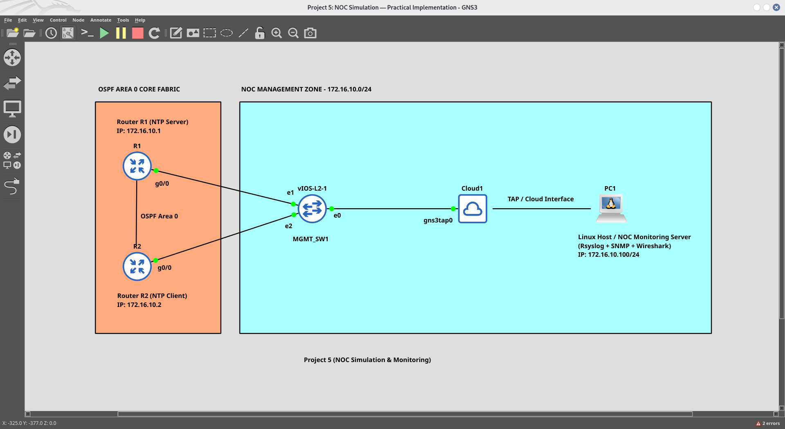

# NOC Simulation & Monitoring Lab

This repository contains a lab for simulating a Network Operations Center (NOC) environment using GNS3 and a small device topology. The lab demonstrates centralized logging (rsyslog), SNMP monitoring, NTP time synchronization, and packet analysis with Wireshark/TShark.

## Project Overview

The NOC Simulation & Monitoring Lab recreates a simple management network and core fabric to teach and test common NOC tasks: collecting logs, polling device telemetry, keeping devices time-synchronized, and capturing/analyzing network traffic. It is suitable for training, demos, and validation of monitoring configurations in a controlled environment.

## Lab Topology (GNS3)

Below is the topology image used for this lab. For full step-by-step configuration, commands and captures, see `Project 5 NOC Simulation.md`.

## Objectives

- NTP: Keep device clocks synchronized across the topology.
- Syslog: Aggregate router logs centrally on a Kali Linux NOC server running rsyslog.
- SNMP: Poll device health and configuration using SNMPv2c.
- Packet Analysis: Capture and inspect NTP, SNMP, and Syslog traffic with Wireshark/TShark.
- Incident Response: Document and practice handling network incidents.

## IP Addressing Scheme (summary)

| Device       | Interface  | IP Address      | Subnet Mask      | Role                                      |
|--------------|------------|-----------------|------------------|-------------------------------------------|
| NOC Server   | gns3tap0   | 172.16.10.100   | 255.255.255.0    | Monitoring host (rsyslog, snmpwalk, wireshark) |
| Router R1    | Gi0/0      | 172.16.10.1     | 255.255.255.0    | Primary gateway / NTP master / SNMP agent |
| Router R2    | Gi0/0      | 172.16.10.2     | 255.255.255.0    | Secondary gateway / NTP client / SNMP agent |

(See `Project 5 NOC Simulation.md` for full configs, verification steps and all capture images.)

## GitHub repository structure (actual)

- README.md
- Project 5 NOC Simulation.md
- GNS3 data/
  - Project 5: NOC Simulation.gns3
- Screenshort/
  - 01_topology.png
  - 02_ntp_status-Router1.png
  - 02_ntp_status-Router2.png
  - 03_ntp_associations-Router1.png
  - 03_ntp_associations-Router2.png
  - 04_syslog_logs.png
  - 05_snmp_walk-Router1.png
  - 05_snmp_walk-Router2.png
  - 06_tshark_capture.png
  - 07_wireshark_capture.png

If you want the repo to include runnable configs and scripts, I can add `configs/` and `scripts/` directories with example files.

---

(README updated to include the topology image and point readers to the full Project 5 document.)
