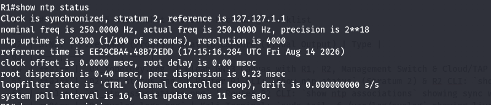
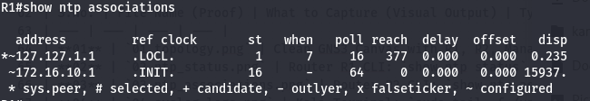
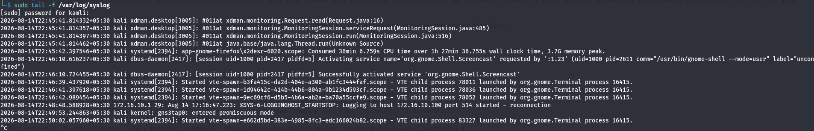
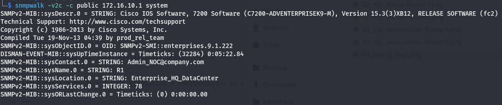
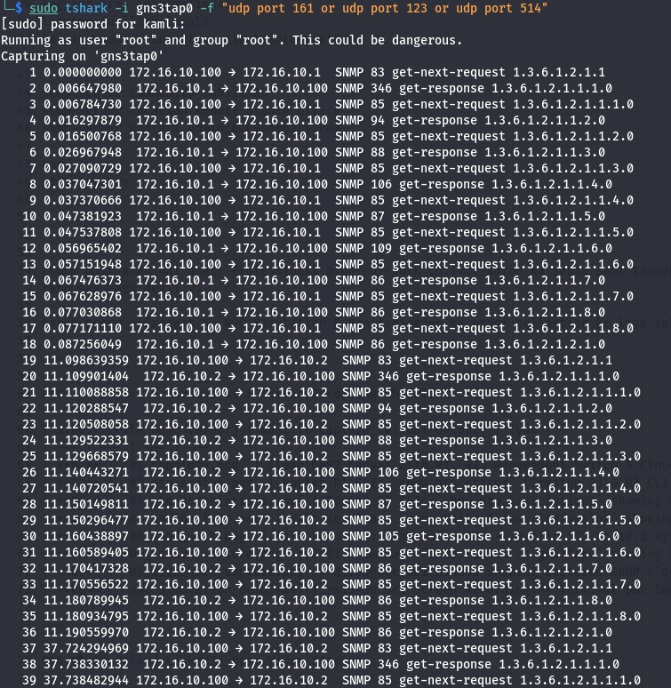
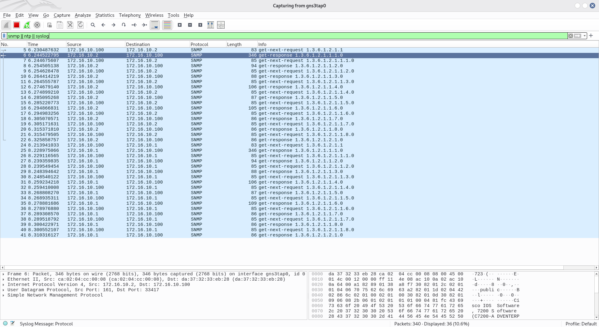

# NOC Simulation & Monitoring Lab

---

## 📌 Project Overview

This repository contains a lab for simulating a Network Operations Center (NOC) environment using GNS3 and a small device topology. The lab demonstrates centralized logging (rsyslog), SNMP monitoring, time synchronization (NTP), and packet capture/analysis with Wireshark/TShark. Full step‑by‑step configurations, verification commands and capture screenshots are in `Project 5 NOC Simulation.md`.

---

## 🏗️ Lab Topology (GNS3)

Below is the topology image used for this lab (replaced the older ASCII/text topology with the actual image from the repository):

---

## 🎯 Objectives

| Module | Technology | Purpose |
| --- | --- | --- |
| **NTP** | Network Time Protocol | Time sync across all devices |
| **Syslog** | Centralized Logging | Collect logs from all devices |
| **SNMP** | Simple Network Management Protocol | Monitor device health |
| **Wireshark** | Packet Analysis | Capture and analyze traffic |
| **Incident Response** | Documentation | Troubleshooting procedures |

---

## 🌐 IP Addressing Scheme (summary)

| Device | Interface | IP Address | Subnet Mask | Role |
| --- | --- | --- | --- | --- |
| NOC Server | `gns3tap0` | 172.16.10.100 | 255.255.255.0 | Monitoring Host (rsyslog, SNMP, Wireshark) |
| Router1 (R1) | Gi0/0 | 172.16.10.1 | 255.255.255.0 | Primary Gateway / NTP Master / SNMP Agent |
| Router2 (R2) | Gi0/0 | 172.16.10.2 | 255.255.255.0 | Secondary Gateway / NTP Client / SNMP Agent |

---

## ⚙️ Quick start (high level)

1. Import `GNS3 data/Project 5: NOC Simulation.gns3` into GNS3 or recreate the topology.
2. Provision a Kali Linux host (NOC server) and bind a TAP interface (`gns3tap0`) to the Cloud node.
3. Apply router configuration snippets from `Project 5 NOC Simulation.md` (NTP, Syslog, SNMP).
4. Start monitoring: rsyslog, snmpwalk and Wireshark/TShark.

---

## 🔎 Verification (examples)

- NTP: `show ntp status` on R1 and `show ntp associations` on R2
- Syslog: `sudo systemctl status rsyslog` and `sudo tail -f /var/log/syslog` on the NOC host
- SNMP: `snmpwalk -v2c -c public 172.16.10.1 system`
- Packet capture: `sudo tshark -i gns3tap0 -f "udp port 161 or udp port 123 or udp port 514"`

NTP and verification screenshots (examples):

Syslog and SNMP screenshots:

Packet capture screenshots:

---

## 📂 Repository contents (actual)

- README.md
- Project 5 NOC Simulation.md
- GNS3 data/
  - Project 5: NOC Simulation.gns3
- Screenshort/
  - 01_topology.png
  - 02_ntp_status-Router1.png
  - 02_ntp_status-Router2.png
  - 03_ntp_associations-Router1.png
  - 03_ntp_associations-Router2.png
  - 04_syslog_logs.png
  - 05_snmp_walk-Router1.png
  - 05_snmp_walk-Router2.png
  - 06_tshark_capture.png
  - 07_wireshark_capture.png

If you want the README to include the full text from `Project 5 NOC Simulation.md` instead of a summary, or want renamed/organized screenshot folders (for example `screenshots/`), tell me and I will update and fix all links accordingly.

---

(README updated to match the structure and screenshots used in `Project 5 NOC Simulation.md`.)
